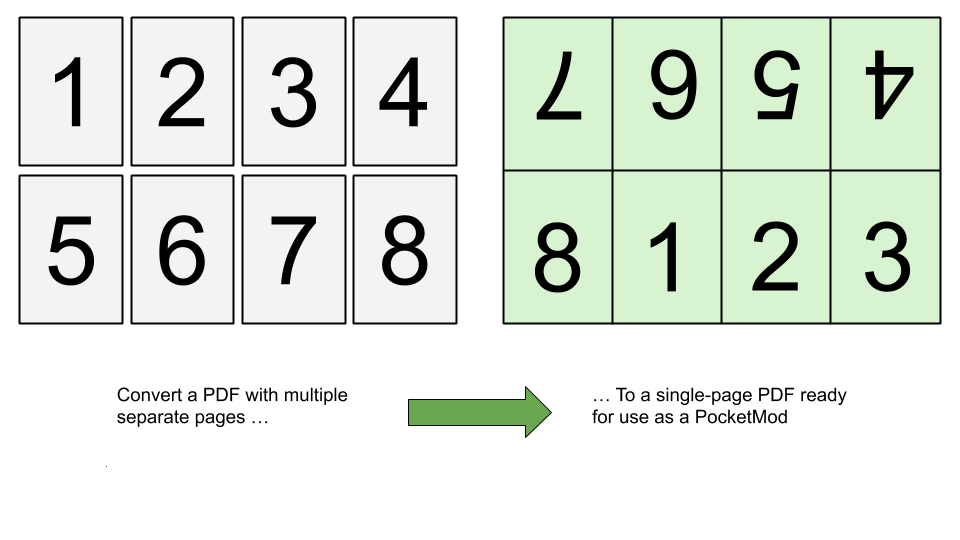

# PocketMod Converter

Python script to convert a PDF into a PocketMod formatted PDF.  
This is a modification of: https://github.com/josephhuang08/pocketmod_converter  
Which was a modification of: https://github.com/mullinscr/pocketmod-creator  
Changes will be listed below in the modification section.

NOTE: This version alters the layout of the output pages, to put the fold on the top of the booklet pages rather than on the bottom. I think this provides a better handling experience.



## What is a PocketMod?
PocketMod is a website and freeware program that helps make 8-paged mini-booklets and organizers out of a single sheet of paper.  
See [pocketmod.com](https://pocketmod.com/) or search online for "PocketMod"
for more information.

## Installation

Clone or download this repository.

## How to use

### Required to install

- [Python](https://www.python.org/) (3.x)
- [PyPDF2](https://github.com/mstamy2/PyPDF2)

PyPDF2 can be installed via pip with:

```bash
$ pip install PyPDF2
```

If you get a deprecated PyDF version error, you can address it like so:

https://stackoverflow.com/questions/74939758/camelot-deprecationerror-pdffilereader-is-deprecated
```bash
$ pip install 'PyPDF2<3.0'
```
(TODO: update to PyPDF 3)

If you get an ImportError for PyDF2 when running the code make sure that you have installed PyPDF2 into the correct version of Python (if you have multiple versions installed on your machine) and that you are executing the correct version of Python.
See issue [#1][i1].

### Running the script

Go to the directory where the `pocketmod_converter.py` script is located.
Open the terminal and type the following where `input.pdf` is the PDF you want
converted.

> **Currently this script assumes the input file is an A4 size PDF,**
> **and it will generate an A4 size PDF as output.**

#### For single file input
```bash
$ python pocketmod_converter.py input.pdf
```

The script will generate and output a custom named PDF in the current
directory:

If `input.pdf` is in another directory then it can referenced as below.
However, the output PDF will still be in the directory of the
`pocketmod_converter.py` script.

```bash
$ python pocketmod_converter.py some/other/location/input.pdf
```

#### For multiple file inputs
Create a folder in the same directory and put all pdfs in the folder.  
Simply change `input.pdf` to the folder's name and then the script will convert all pdf files in the folder.

## Trouble shooting
You may run into an error with PyPDF2 when the pdf contain special characters.
```
unicodeencodeerror: 'latin-1' codec can't encode characters in position 8-11: ordinal not in range(256)
```
In order to fix this error:  
Change line 488 in file `generic.py`
```
try:
   return NameObject(name.decode('utf-8'))
   except (UnicodeEncodeError, UnicodeDecodeError) as e:
   # Name objects should represent irregular characters
   # with a '#' followed by the symbol's hex number
   if not pdf.strict:
      warnings.warn("Illegal character in Name Object", utils.PdfReadWarning)
      return NameObject(name)
   else:
      raise utils.PdfReadError("Illegal character in Name Object")
```
To
```
try:
     return NameObject(name.decode('utf-8'))
except (UnicodeEncodeError, UnicodeDecodeError) as e:
     try:
         return NameObject(name.decode('gbk'))
     except (UnicodeEncodeError, UnicodeDecodeError) as e:
         # Name objects should represent irregular characters
         # with a '#' followed by the symbol's hex number
         if not pdf.strict:
             warnings.warn("Illegal character in Name Object", utils.PdfReadWarning)
             return NameObject(name)
         else:
             raise utils.PdfReadError("Illegal character in Name Object")
```
And in file `utils.py` line 238
```
r = s.encode('latin-1')
if len(s) < 2:
    bc[s] = r
return r
```
To
```
try:
    r = s.encode('latin-1')
    if len(s) < 2:
        bc[s] = r
    return r
except Exception as e:
    print(s)
    r = s.encode('utf-8')
    if len(s) < 2:
        bc[s] = r
    return r
```
Credit: https://blog.csdn.net/weixin_43116153/article/details/105218309

## Modifications

- Allow to convert more than 8 pages.
- Allow naming the output file.
- Allow for multiple input files.
- Changed layout of output pocketmod to place the fold at the top of the booklet

[i1]: https://github.com/mullinscr/pocketmod-creator/issues/1
